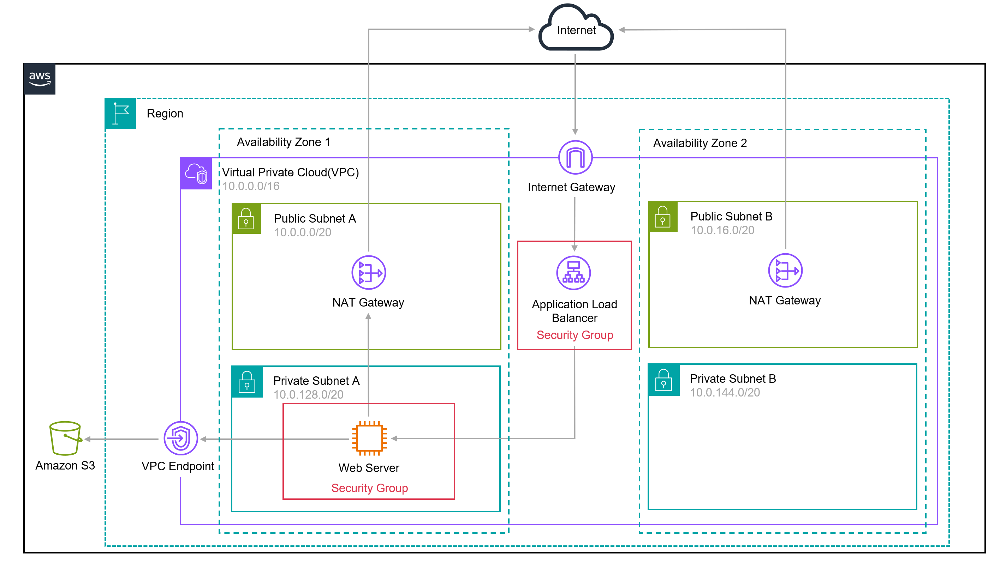

# ☁️ AWS 101 Lab — Web Server Altamente Disponível e Seguro

> Projeto construído na **Imersão AWS — Dia 1: Fundamentos Cloud**,
> baseado no workshop oficial *AWS 101 Workshop*.
> Aprender fazendo. Documentar como engenheiro.

## 🎯 Objetivo
Provisionar uma aplicação web completa com:
- **Alta disponibilidade** — VPC em 2 AZs;
- **Defesa em profundidade** — backend em subnets privadas, ALB como única entrada;
- **Zero credenciais nos servidores** — IAM roles + credenciais temporárias;
- **Zero SSH aberto** — administração via SSM Session Manager;
- **Elasticidade** — Auto Scaling Group com auto-recuperação;
- **Storage privado** — S3 com acesso público bloqueado + VPC Endpoint.

## 🏗️ Arquitetura

Internet → IGW → ALB (subnets públicas) → EC2/ASG (subnets privadas)
EC2 → NAT Gateway (saída) · EC2 → VPC Endpoint → S3

## 🧱 Serviços e conceitos
| Serviço | Papel | Conceito-chave |
|---|---|---|
| VPC | Rede isolada | CIDR, subnets, route tables, multi-AZ |
| IGW / NAT GW | Entrada / saída | pública vs privada |
| ALB | Entrada camada 7 | health checks, target groups |
| EC2 | Compute | user data, launch template |
| ASG | Elasticidade | desired capacity, auto-recuperação |
| Security Groups | Microssegmentação | chaining, stateful, menor privilégio |
| IAM | Identidade | role, instance profile, sem chaves |
| SSM | Administração | Session Manager sem porta 22 |
| S3 | Storage | privado por padrão, VPC Endpoint |

## 📖 Documentação por módulo
1. [Networking (VPC)](docs/01-networking-vpc.md)
2. [Security Groups](docs/02-security-groups.md)
3. [IAM](docs/03-iam.md)
4. [EC2](docs/04-ec2.md)
5. [SSM](docs/05-ssm.md)
6. [ALB](docs/06-alb.md)
7. [S3](docs/07-s3.md)
8. [ASG](docs/08-asg.md)

## 🐛 Troubleshooting real (o que tutorial não mostra)
- **#1** Route table privada sem rota para o NAT (mód. 01);
- **#2** VPC Endpoint criado, mas sem route tables associadas (mód. 07);
- **#3** `%20` — o espaço invisível que quebrou o S3 (mód. 07);
- **#4** Kill test — matar instância e ver o ASG curar o sistema (mód. 08).

## 💰 FinOps
~US$ 0,44/h em lab. Maiores custos ociosos: NAT Gateways e ALB.
Cleanup completo documentado em `docs/09-cleanup-checklist.md`.

## 🔐 Segurança deste repo
Screenshots com Account ID censurado; ARNs com placeholder
`<ACCOUNT_ID>`; zero credenciais reais; bucket privado por padrão.

## 🚀 Próximos passos
- [ ] Reescrever o lab em **Terraform** (IaC);
- [ ] Workshop **AWS 101 — Containers**;
- [ ] HTTPS com ACM + redirect 80→443;
- [ ] Observabilidade: CloudWatch + access logs do ALB.

## 📰 Série de posts
Documentação derivada em posts no LinkedIn — link no perfil.
