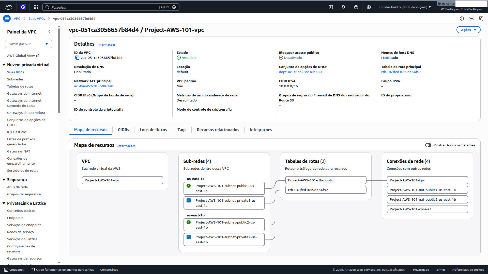

# 01 — Networking (VPC)

**Status:** ✅ Concluído · **Módulo:** Setup Networking (VPC)

## O que é
VPC é a rede virtual isolada onde defino CIDR, subnets, rotas e
acesso à internet. Aqui: `10.0.0.0/16` em 2 Availability Zones.

## Problema que resolve
Isolamento de rede, controle do que é público vs. privado e
alta disponibilidade via distribuição multi-AZ.

## O que fiz
1. VPC `Project-AWS-101-vpc` (10.0.0.0/16) com DNS hostnames habilitado;
2. Quatro subnets em 2 AZs;
3. Internet Gateway (entrada de tráfego);
4. Dois NAT Gateways com EIP (saída de tráfego das privadas);
5. Route tables: pública (`0.0.0.0/0 → IGW`) e privada (`0.0.0.0/0 → NAT`);
6. VPC Endpoint (gateway) para S3.

| Subnet | AZ | CIDR | Tipo | Papel |
|---|---|---|---|---|
| public1 | 1a | 10.0.0.0/20 | Pública | ALB + NAT |
| public2 | 1b | 10.0.16.0/20 | Pública | ALB + NAT (HA) |
| private1 | 1a | 10.0.128.0/20 | Privada | Web servers |
| private2 | 1b | 10.0.144.0/20 | Privada | Web servers (HA) |

## O que aprendi
- Subnet "pública" = route table com rota ao IGW; privada = saída só via NAT;
- AWS reserva 5 IPs por subnet; /20 = 4.096 endereços;
- 1 NAT por AZ = independência de zona (padrão de referência AWS);
- NAT Gateway custa mesmo ocioso (~US$ 0,045/h cada) → prioridade no cleanup;
- Endpoint gateway S3 é gratuito e mantém o tráfego dentro da AWS.

## Trade-off observado
O workshop usa uma route table única para as privadas; o ideal em
produção seria uma por AZ (rota para o NAT da própria zona).

## Trade-off arquitetural

O workshop cria uma única route table para as subnets privadas, apontando 
para um único NAT Gateway. Em produção, o padrão de referência AWS seria:

- Route table privada 1a → NAT Gateway 1a
- Route table privada 1b → NAT Gateway 1b

Isso elimina dependência cross-AZ e remove o ponto único de falha. 
Mas no contexto deste lab, a abordagem simplificada é suficiente.

## Se eu refizesse
Planejaria o CIDR pensando em peering/VPN futuros (sobreposição com
on-premise é um erro clássico) e criaria as route tables privadas por AZ.

