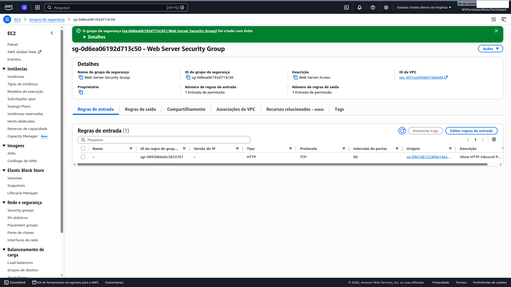

# 02 — Security Groups (SGs)

**Status:** ✅ Concluído · **Módulo:** Resource Security (SGs)

## O que é
Firewall de nível de recurso, **stateful**: permitido o ida,
a volta entra automática (diferente de NACLs, que são stateless).

## O que fiz
Microssegmentação em duas camadas:

| SG | Inbound | Outbound |
|---|---|---|
| LoadBalancerSG | TCP 80 de 0.0.0.0/0 | todo (default) |
| WebServerSG | TCP 80 **do LoadBalancerSG** | todo (default) |

## O que aprendi
- Chaining de SGs: a origem da regra é *outro SG*, não um CIDR —
  expressa intenção ("só o ALB fala com o web server") e não quebra
  se a topologia mudar;
- Stateful vs stateless (SG vs NACL);
- Zero porta 22 → administração via SSM (módulo 05);
- TLS termina no ALB; ALB→EC2 em HTTP é um trade-off aceitável
  dentro da rede privada (produção: 443 ponta a ponta se exigido).

## Se eu refizesse
- Descrições significativas em todas as regras (a do LB ficou genérica);
- Produção: 443 no ALB + redirect 80→443;
- Hardening: outbound restrito no WebServerSG.

