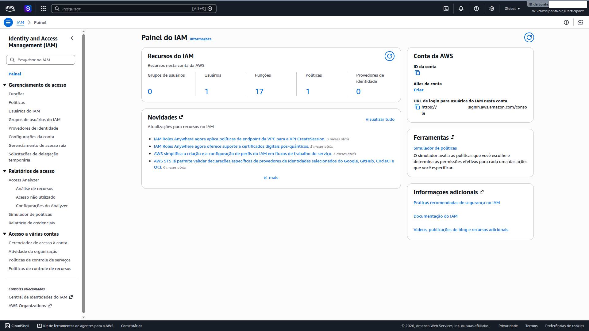

# 03 — Access Management (IAM)

**Status:** ✅ Concluído · **Módulo:** Access Management (IAM)

## O que é
IAM gerencia identidades e permissões. Neste lab, o servidor não recebe
credenciais estáticas: ele **assume uma role** entregue via instance profile.

| Conceito | Papel no lab |
|---|---|
| Usuário | Pessoa na console (eu) |
| Role | Identidade temporária assumida por serviços (EC2) |
| Instance profile | "Envelope" que entrega a role ao EC2 no launch |

## O que fiz
- Role `WebServerInstanceProfile` com confiança em `ec2.amazonaws.com`;
- Política gerenciada `AmazonSSMManagedInstanceCore`
  (ssm / ec2messages / ssmmessages) — o que o agent do SSM precisa;
- Zero access keys: credenciais temporárias via metadata service,
  com rotação automática.

## O que aprendi
- Trust relationship define *quem pode assumir* a role — aqui, só o EC2;
- Sem chaves no servidor = nada para vazar em código ou repositórios;
- Credenciais temporárias expiram; chaves estáticas, nunca.

## Trade-offs e decisões
- **Política gerenciada vs customizada:** a gerenciada é mais ampla que o
  mínimo estrito, mas é a recomendada pela AWS para SSM e se atualiza
  sozinha. Hardening de produção: política inline só com as ações do agent.
- **IMDS:** em produção, forçar IMDSv2 (hop limit 1) contra SSRF.
- **Sessão de 1h:** default, suficiente para o lab.

## Se eu refizesse
- Usar "Gerar política com base em eventos do CloudTrail" ao fim do lab
  para right-size das permissões com base no uso real;
- No módulo S3: anexar somente leitura (`s3:GetObject` no bucket
  específico) — nunca full access.

