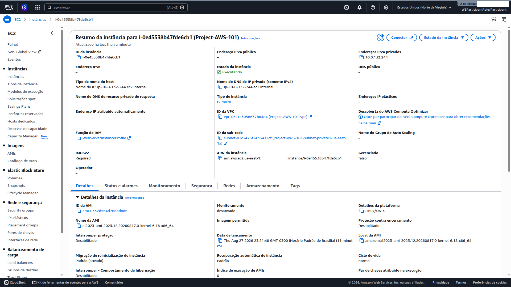
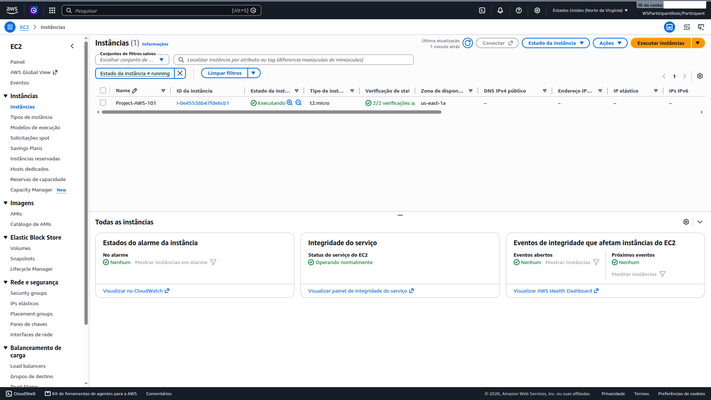

# 04 — Deploy Compute (EC2)

**Status:** ✅ Concluído · **Módulo:** Deploy Compute (EC2)

## O que é
EC2 é o serviço de compute virtualizado. Aqui: instância Linux em subnet
privada, sem SSH, administrada via SSM.

## O que fiz

| Configuração | Valor |
|---|---|
| AMI | Amazon Linux 2023 (kernel 6.18, x86_64) |
| Tipo | t2.micro (1 vCPU, 1 GiB RAM) |
| Subnet | private1-us-east-1a (10.0.128.0/20) |
| IP público | Desabilitado |
| Security Group | WebServerSecurityGroup |
| IAM Profile | WebServerInstanceProfile |
| Par de chaves | Nenhum (administração via SSM) |

**User data:** script de bootstrap que instala SSM agent, Apache, PHP e páginas do lab.

## O que aprendi
- Instância em subnet privada + sem IP público = sem ataque direto via internet;
- Sem par de chaves = sem SSH = menos superfície de ataque;
- SSM Session Manager funciona porque: (1) a instância tem a role IAM, (2) o agent SSM está instalado, (3) há rota para internet via NAT Gateway;
- User data é executado como root no boot — cuidado com comandos destrutivos.

## Trade-offs e decisões

### 1. t2.micro vs t3.micro
- **t2.micro:** geração anterior, preço ~$0.0116/h, Free Tier (750h/mês).
- **t3.micro:** geração atual (Nitro), performance 15-30% melhor, preço ~$0.0104/h.
- **Decisão:** t2.micro para o lab (Free Tier). Produção: t3 ou t4g (ARM, mais barato).

### 2. Amazon Linux 2023 vs AL2
- **AL2023:** kernel moderno (6.18), baseado em Fedora, suporte até 2028.
- **AL2:** kernel antigo (4.14), suporte estendido até 2025.
- **Decisão:** AL2023 (mais atual). Legacy systems: AL2.

### 3. Dependência do NAT Gateway
SSM agent precisa de saída de internet para registrar com o serviço AWS.
Se o NAT Gateway falhar ou a rota 0.0.0.0/0 estiver errada, a instância
não aparece no Session Manager. Documente essa dependência em produção.

## Se eu refizesse
- User data com `dnf` em vez de `yum` (Amazon Linux 2023 usa dnf);
- Verificar existência de arquivos antes de `rm` (evitar erros silenciosos);
- Testar URL do AWS SDK PHP (pode estar desatualizada);
- Usar t3.micro para melhor performance/custo.

