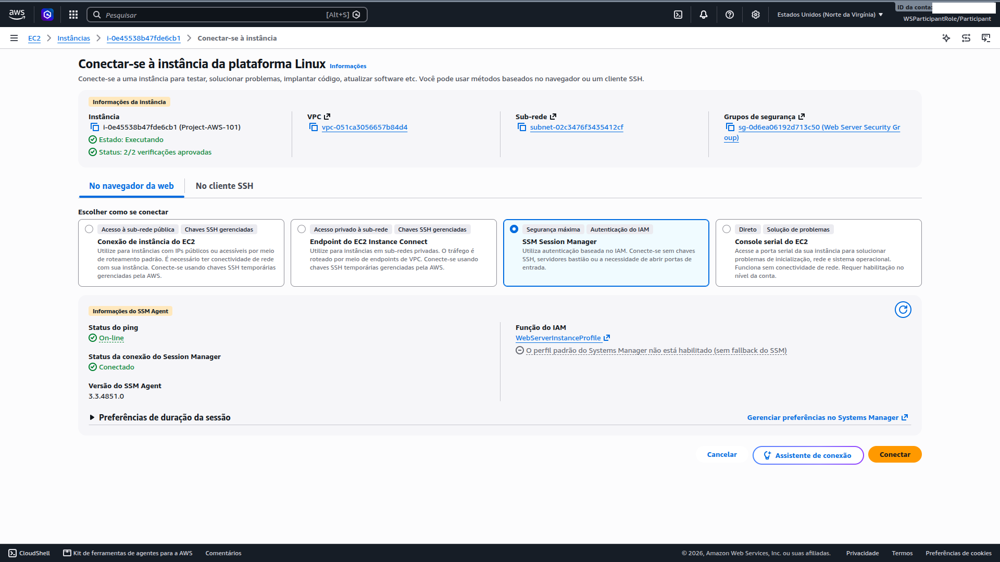
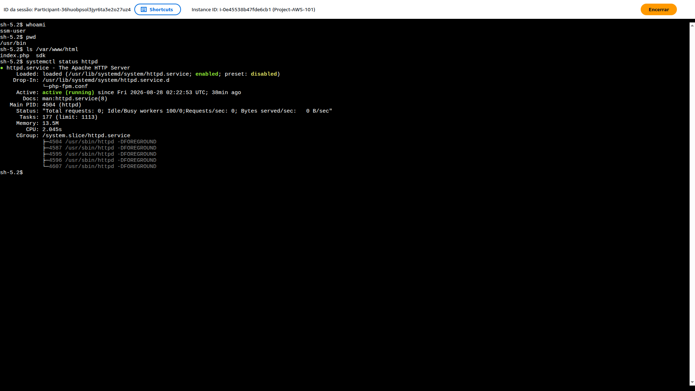

# 05 — Administer Web Server (SSM)

**Status:** ✅ Concluído · **Módulo:** Administer Web Server (SSM)

## O que é
SSM Session Manager é o método recomendado pela AWS para administrar
instâncias EC2 sem abrir porta 22, sem servidor bastião e sem gerenciar
chaves SSH. Autenticação 100% via IAM.

## O que fiz
- Conectei à instância via console AWS (Session Manager);
- Validei user data (Apache, PHP, SDK instalados);
- Testei conectividade de saída (NAT Gateway) com `ping google.com`.

## Validações executadas

```bash
sh-5.2$ whoami
ssm-user                          # autenticação via IAM

sh-5.2$ systemctl status httpd
Active: active (running)          # Apache operacional

sh-5.2$ ping google.com
0% packet loss                    # NAT Gateway funcional
```



