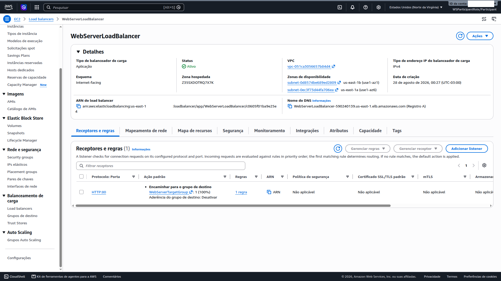
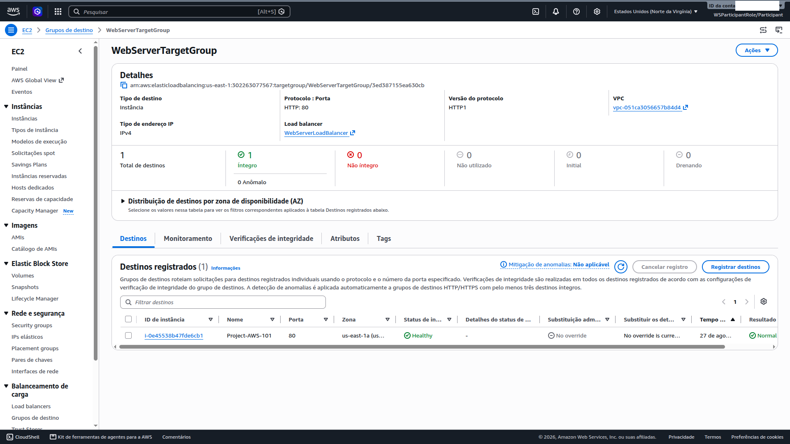
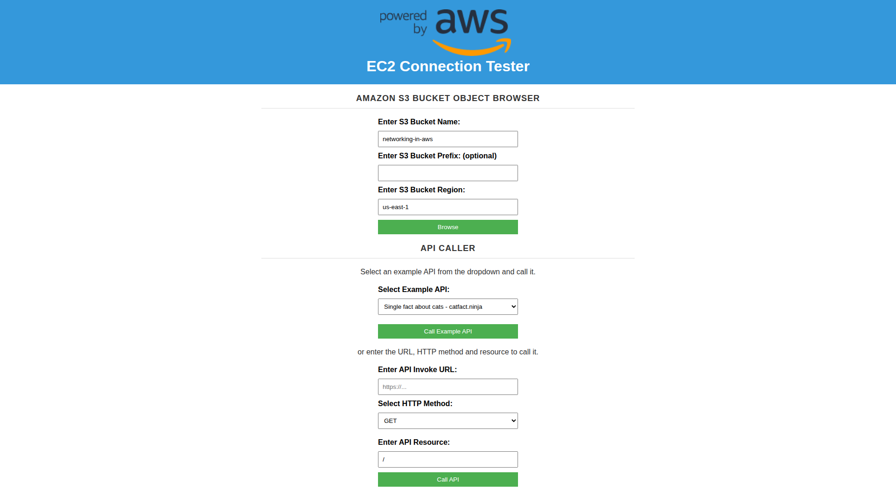

# 06 — Load Balancing (ALB)

**Status:** ✅ Concluído · **Módulo:** Load Balancing (ALB)

## O que é
ALB é o balanceador de camada 7: distribui requisições HTTP(S) entre
targets saudáveis, com health checks automáticos.

## O que fiz
- ALB internet-facing nas 2 subnets **públicas** (2 AZs);
- SG anexado: LoadBalancerSecurityGroup (80 de 0.0.0.0/0);
- Listener HTTP:80 → WebServerTargetGroup;
- Target: instância privada i-... (health check HTTP / → Saudável);
- Acesso público somente pelo DNS do ALB.

## O que aprendi
- O ALB é o único componente com IP público da aplicação;
  o backend permanece invisível (subnet privada);
- Health check remove target doente automaticamente → resiliência;
- DNS do ALB é estável; os IPs por trás mudam (nunca apontar IP fixo).

## Trade-offs e decisões
- HTTP-only no lab; produção: listener 443 + certificado ACM + redirect 80→443;
- Adesência (stickiness) desativada: correta para app stateless;
  ativar apenas se o app guardar sessão local (e preferir mover sessão
  para Redis/ElastiCache em vez de stickiness).

