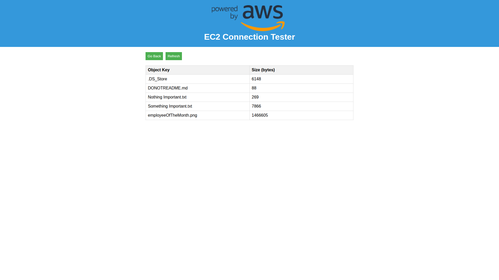
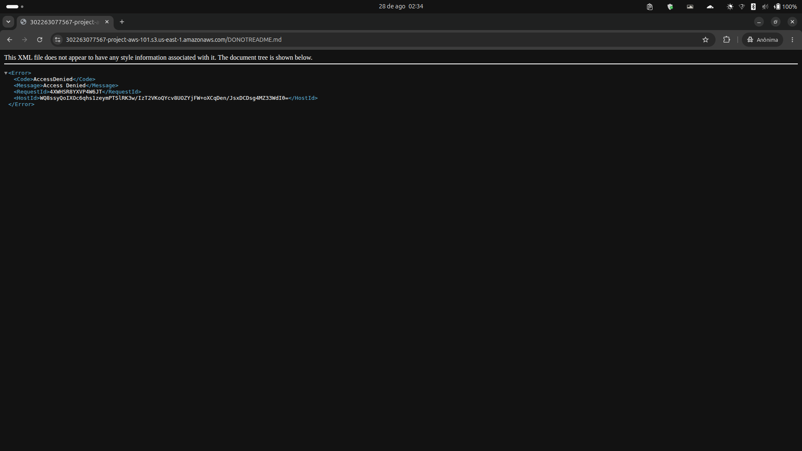

# 07 — Storage (S3)

**Status:** ✅ Concluído · **Módulo:** Storage (S3)

## O que é
S3 é armazenamento de objetos. Buckets nascem **privados**: ninguém
acessa sem permissão explícita.

## O que fiz
- Bucket em us-east-1 com **Block Public Access ativado**;
- Política inline `WebServerS3ReadOnly` na role
  (`s3:GetObject` + `s3:ListBucket` restritos ao bucket);
- **Correção:** associei o VPC Endpoint (gateway) S3 às route tables —
  antes, o tráfego S3 saía pelo NAT sem ninguém perceber;
- Testes A (app lista objetos), B (URL pública → 403),
  C (`aws s3 ls` via SSM, sem credenciais configuradas).

## O que aprendi
- `sts get-caller-identity` prova que a instância assume a role
  (credenciais temporárias via IMDS, zero chaves);
- Identity policy (IAM) vs resource policy (bucket): no mesmo account,
  a identity basta; a resource entra em cross-account/condições extras;
- Gateway endpoint é gratuito e age via route table (prefix list do S3);
- Nome de bucket é informação pública → nunca embutir Account ID
  em projetos reais.

## Leitura de erros S3 (tabela de bolso)
| Erro | Significado |
|---|---|
| InvalidBucketName | sintaxe inválida (espaço, maiúscula...) |
| NoSuchBucket | não existe / região errada |
| AccessDenied | existe, mas sem permissão |

## Troubleshooting real #3: o espaço invisível
`ListObjectsV2` falhou com InvalidBucketName; a URL mostrava `%20`
no fim do nome. Caractere invisível colado no campo = bucket inválido.
Lição: ler a URL do erro antes de culicar em permissões/rede.

## Trade-offs e decisões
- Política do endpoint mantida default (lab); hardening opcional
  quebraria fluxos que usam outros buckets via endpoint;
- Sem versioning/lifecycle no lab; produção: versioning + lifecycle
  + access logging para auditoria.

