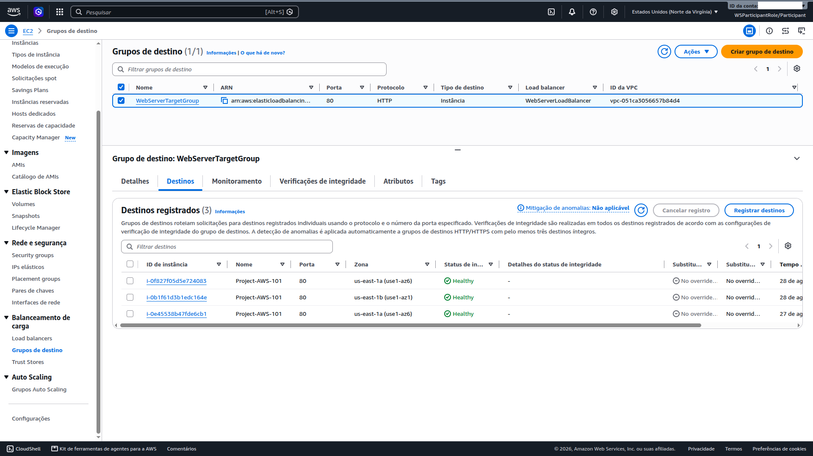
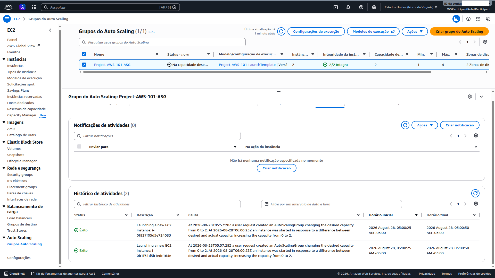

# 08 — Scaling (ASG) [Challenge]

**Status:** ✅ Concluído · **Módulo:** Scaling (ASG) — Challenge

## O que é
Auto Scaling Group trata instâncias como rebanho, não como pets:
se uma morre, outra nasce; se a carga sobe, o rebanho cresce.

## O que fiz
1. **Launch Template** `Project-AWS-101-LaunchTemplate` a partir da
   instância original (AL2023, t2.micro, WebServerSG, instance profile,
   user data de bootstrap, sem chave SSH, sem IP público);
2. **ASG** `Project-AWS-101-ASG`:
   - Subnets: as duas **privadas** (us-east-1a + us-east-1b);
   - Target Group existente: `WebServerTargetGroup`;
   - Grace period: **300 s** (o bootstrap leva ~2–3 min);
   - Capacidade: min=1, desired=2, max=4;
3. Validação: 2 instâncias InService em 2 AZs + 3 targets Healthy no ALB.

## Evidências

## O que aprendi
- Launch Template = blueprint versionado; a subnet fica no ASG (não no
  template) para permitir multi-AZ;
- Grace period curto demais causa ciclo launch→terminate (falso negativo
  do health check durante o bootstrap);
- O Target Group não distingue instância manual de instância do ASG:
  os 3 targets coexistiram sem conflito;
- O histórico de atividades é a trilha de auditoria do scaling.

## Trade-offs e decisões
- Capacidade fixa (2) no lab; produção: Target Tracking (CPU ~50%);
- Sem Spot; produção: Mixed Instances Policy para custo;
- Sem lifecycle hooks; produção: hooks + SNS para drenar conexões.

## Limitação documentada
O ambiente do workshop expirou antes do **kill test** (terminar uma
instância e observar o ASG recriá-la). Fica registrado como próxima
execução — o histórico de atividades já prova que o ASG cria instâncias
saudáveis do zero, e a arquitetura (multi-AZ + ALB + ASG) é a mesma que
sustenta a auto-recuperação.

## Se eu refizesse
- Capturaria o kill test **antes** de qualquer outro print;
- Warm Pools + notificações SNS de atividade;
- Versionar o Launch Template desde o início (rollback).
