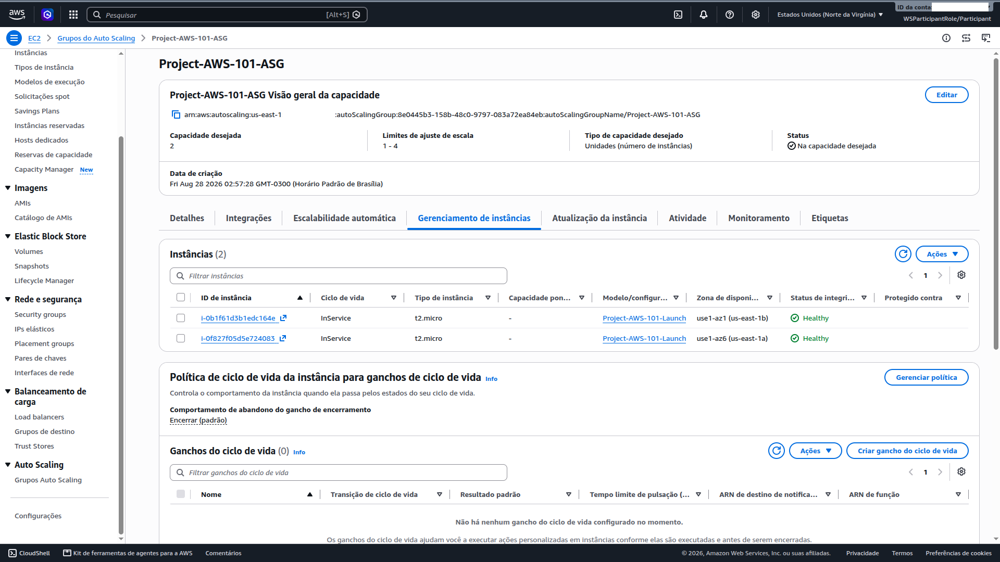

# 08 — Scaling (ASG) [Challenge]

**Status:** ✅ Concluído · **Módulo:** Scaling (ASG) — Challenge

## O que é
Auto Scaling Group trata instâncias como **rebanho, não como pets**:
se uma morre, outra nasce; se a carga sobe, o rebanho cresce.

## O que fiz
1. **Launch Template** `Project-AWS-101-LaunchTemplate` criado a partir
   da instância original (AMI, t2.micro, WebServerSG, instance profile,
   user data de bootstrap, sem chave SSH, sem IP público);
2. **ASG** `Project-AWS-101-ASG`:
   - Subnets: as duas **privadas** (1a + 1b);
   - Target Group existente: `WebServerTargetGroup`;
   - Health check grace period: **300s** (o bootstrap leva ~2-3 min);
   - Capacidade: min=1, desired=2, max=4;
3. Validação: 2 instâncias InService em AZs diferentes, 3 targets
   Healthy no ALB (2 do ASG + 1 original).

## O que aprendi
- Launch Template = blueprint versionado; a subnet fica no ASG, não no
  template (flexibilidade multi-AZ);
- Grace period curto demais causa ciclo launch→terminate→launch
  (falso negativo do health check durante o bootstrap);
- O Target Group não distingue instância "pet" (manual) de "cattle" (ASG):
  os 3 targets coexistiram sem conflito.

## Trade-offs e decisões
- **Target Tracking (CPU 50%)** vs Step/Scheduled: mais simples e eficaz
  para workload típico;
- **Sem Spot no lab**; produção: Mixed Instances Policy para custo;
- **Sem lifecycle hooks**; produção: hooks + SNS para drenar conexões
  antes do terminate.

## Se eu refizesse
- Warm Pools para scale-out mais rápido;
- Notificações de atividade via SNS (observabilidade do scaling);
- Versionar o Launch Template desde o início (v1, v2...) p/ rollback.

